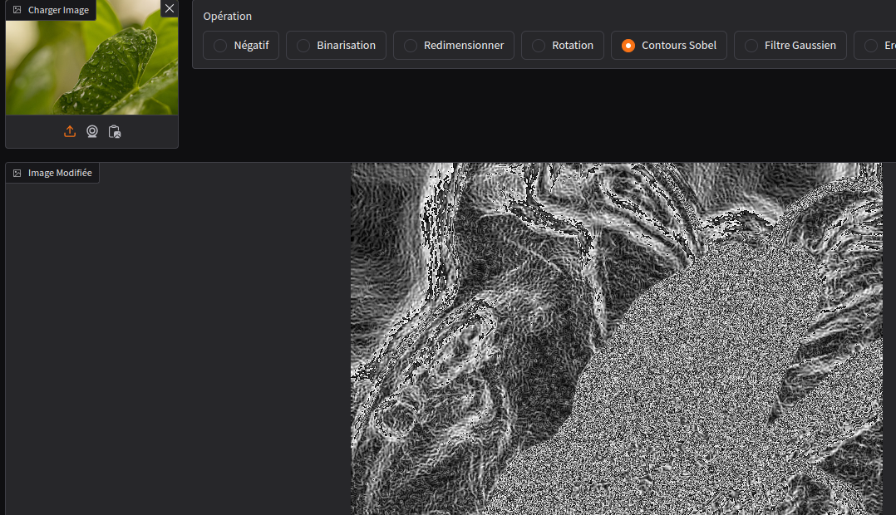

---
title: "<a href='https://huggingface.co/spaces/Ynvers/ImageMaster'>🖼️Image Processing Application with Gradio, Pillow, and OpenCV</a>"
excerpt: "An interactive application for performing image processing operations, built using Gradio, Pillow, and OpenCV. Features include transformations, filters, and visualizations with Matplotlib. "
collection: portfolio
---