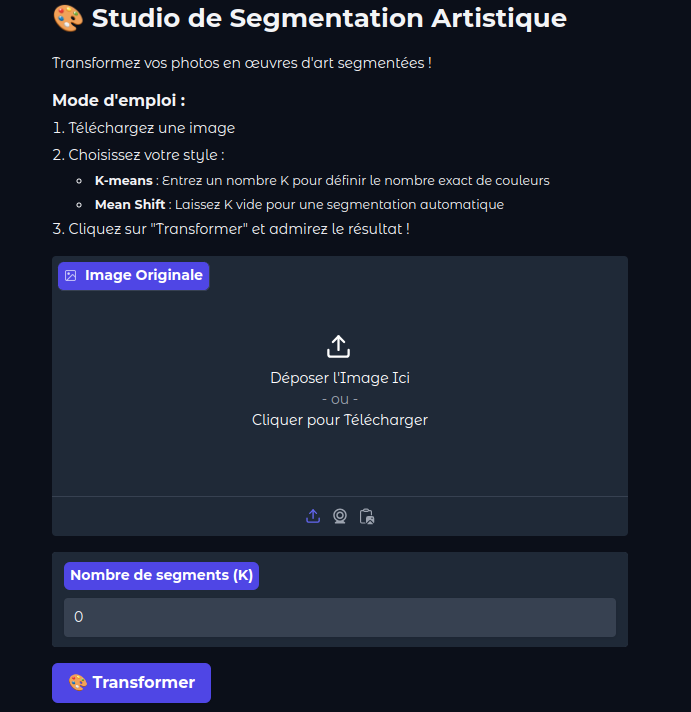

---
title: "<a href='https://huggingface.co/spaces/Ynvers/Segment'>🎨Image Segmentation Application with Mean Shift and K-Means</a>"
excerpt: "An interactive application for segmenting images, built from scratch using custom implementations of Mean Shift and K-Means algorithms. This tool is designed for precision and learning, featuring step-by-step visualizations of the segmentation process and interactive demonstrations. "
collection: portfolio
---